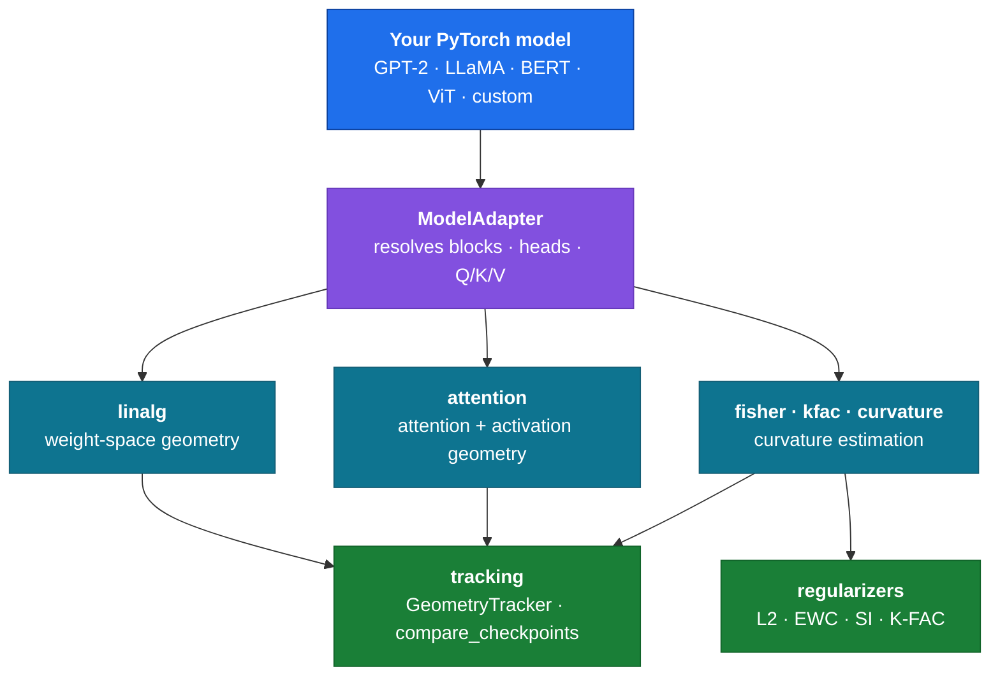

<div align="center">

<h1>modelgeometry</h1>

<p>
  <b>See the shape of your transformer.</b><br/>
  Architecture-agnostic inspection of <b>weight-space geometry</b>, <b>attention geometry</b>,<br/>
  and <b>curvature</b> (Fisher / K-FAC) for any trained PyTorch model.
</p>

[](https://pypi.org/project/modelgeometry/)
[](https://pypi.org/project/modelgeometry/)
[](https://github.com/Siddhesh290307/modelgeometry/actions/workflows/ci.yml)
[](LICENSE)
[](https://colab.research.google.com/github/Siddhesh290307/modelgeometry/blob/main/examples/colab_demo.ipynb)

<a href="#install">Install</a> ·
<a href="#quickstart">Quickstart</a> ·
<a href="#how-it-works">How it works</a> ·
<a href="#whats-in-the-box">What's in the box</a> ·
<a href="#api-reference">API</a> ·
<a href="#citations">Citations</a>

</div>

---

> [!NOTE]
> `modelgeometry` works on **any** `nn.Module` with standard attention layers — GPT-style
> decoder-only models, encoder models, vision transformers, and custom architectures — through
> a single adapter abstraction, rather than hardcoding one model family's attribute names.

|  |  |
|:--|:--|
| 🧩 **Architecture-agnostic** | One adapter resolves fused (`c_attn`, `qkv`) and split (`q_proj`, `query`) conventions alike — GPT-2, LLaMA, BERT, ViT, or your own module |
| 📚 **Published methods only** | Every metric implements a named, independently published technique, cited in its docstring — no bespoke composite indices |
| 🔬 **Primitives, not opinions** | Returns plain `float` / `ndarray` / `dict`. The library never prescribes which comparison is meaningful — you do |
| 🪝 **Non-invasive** | Hooks are context-managed and fully removed on exit. Your model is never permanently mutated |
| 🧪 **Cross-architecture tested** | Every metric is tested against at least two structurally different adapters, so nothing silently assumes one layout |
| 🪶 **Headless by default** | `import modelgeometry` never pulls in matplotlib — plotting is an opt-in extra, so it runs fine in CI |

## Install

```bash
pip install modelgeometry            # core: weight + attention geometry, Fisher, K-FAC
pip install "modelgeometry[report]"  # + matplotlib plotting helpers
```

<sub>Requires Python ≥ 3.9 and PyTorch ≥ 2.0.</sub>

## Quickstart

Point it at a model you already have. No training, no dataset, no config:

```python
import torch
from transformers import GPT2LMHeadModel
from modelgeometry import resolve_adapter, effective_rank, spectral_norm

model = GPT2LMHeadModel.from_pretrained("gpt2")
adapter = resolve_adapter(model)          # auto-detects the architecture's layout

for layer in range(adapter.num_layers()):
    q = adapter.qkv_weights(layer).q      # always (out, in), whatever the source convention
    print(f"layer {layer:2d}  eff. rank {effective_rank(q):7.2f}  spectral norm {spectral_norm(q):6.2f}")
```

Swap `GPT2LMHeadModel` for a `timm` ViT, a BERT encoder, or your own transformer — the rest of
the snippet is unchanged. That's the whole point of the adapter.

> [!TIP]
> Want to see everything at once? The [**Colab notebook**](examples/colab_demo.ipynb) runs the
> entire API against a real pretrained GPT-2 **and** a pretrained ViT, end to end, on a free T4.

## How it works

Every function that touches a model's parameters goes through a `ModelAdapter`, which resolves
attention blocks, head counts, and Q/K/V projections across naming conventions. Metrics never
see a raw attribute path:



```python
adapter = resolve_adapter(model)
adapter.num_layers()
adapter.qkv_weights(i)       # QKVWeights(q, k, v) — three separate (out, in) matrices
adapter.attention_module(i)  # the live module, for hooks
adapter.num_heads(), adapter.head_dim()
```

If a model doesn't match a recognized convention, `resolve_adapter` **raises with instructions
rather than guessing**. Override any step explicitly:

```python
adapter = resolve_adapter(
    model,
    layer_path="model.decoder.layers",
    attn_name="self_attn",
    qkv_names=("q_proj", "k_proj", "v_proj"),
)
```

## What's in the box

### Weight-space geometry

No forward pass, no data — reads straight off any checkpoint.

```python
from modelgeometry import effective_rank, spectral_norm, row_cosine_similarity

q = adapter.qkv_weights(0).q
effective_rank(q)          # information-theoretic effective dimensionality
spectral_norm(q)           # largest singular value
row_cosine_similarity(q)   # (n, n) redundancy matrix across projection rows
```

### Attention & activation geometry

Captured through a context-managed hook — the model is restored exactly as it was.

```python
from modelgeometry import HookRegistry, capture_attention_weights, attention_entropy

registry = HookRegistry()
with registry:
    capture_attention_weights(registry, "layer0", adapter.attention_module(0))
    model(input_ids, output_attentions=True)

attention_entropy(registry.captured["layer0"])   # Michel et al. 2019; Voita et al. 2019
```

> [!IMPORTANT]
> Capturing attention weights requires the model's **eager** attention implementation. Fused
> kernels (`sdpa`, flash-attention) never materialize the tensor. Load with
> `attn_implementation="eager"`.

### Curvature

```python
from modelgeometry import diagonal_fisher, fisher_layer_summary, kfac_factors

fisher = diagonal_fisher(model, dataloader, n_samples=256, loss_fn=my_loss_fn)
fisher_layer_summary(fisher)     # per-parameter mass, top-k mass fraction, effective rank

factors = kfac_factors(model, dataloader, n_samples=256, loss_fn=my_loss_fn)
```

`diagonal_fisher` computes **true per-sample gradients** via `torch.func.vmap(grad(...))`.
Averaging gradients across a batch before squaring underestimates the Fisher for any converged
model — this implementation never does that, and it's unit-tested against an independent
autograd ground truth.

### Regularizers

Published formulations, generically parameterized, for any training loop.

```python
from modelgeometry import EWCPenalty

reg = EWCPenalty(model, fisher=fisher, anchor_params=anchor)
loss = task_loss + reg.penalty()
```

### Tracking & comparison

```python
from modelgeometry import GeometryTracker, compare_checkpoints

tracker = GeometryTracker(model, metrics=[
    ("qkv0_rank", lambda m, a: effective_rank(a.qkv_weights(0).q)),
])
tracker.log_step(step)   # from any loop — vanilla PyTorch, HF Trainer, Lightning

compare_checkpoints(model_a, model_b, metrics=[...])
```

## Which metric for which question

| Your question | Reach for |
|:--|:--|
| **Which attention heads are prunable?** | Low `attention_entropy` / `attention_effective_rank` on a head across many batches <sub>(Michel et al. 2019; Voita et al. 2019)</sub> |
| **What actually changed during finetuning?** | `compare_checkpoints` with `effective_rank`, `row_cosine_similarity`, or `distributional_distance` |
| **Is this training run healthy?** | `GeometryTracker` logging `effective_rank` or `fisher_layer_summary`, watching for rank collapse or curvature blow-up |
| **Which parameters matter most?** | `diagonal_fisher` → `fisher_layer_summary` for per-layer importance mass |
| **Are two models in a comparable regime?** | The same adapter-based metrics on both, before drawing conclusions from either |

These are starting points, not a taxonomy. Every function returns plain data, so it composes
into whatever analysis you're actually running.

## API reference

<details>
<summary><b>All 29 public exports</b> — click to expand</summary>

<br/>

**Adapters & hooks** — `modelgeometry.adapters`, `modelgeometry.hooks`

| Name | What it does |
|:--|:--|
| `resolve_adapter` | Auto-detect and build the right adapter, with explicit overrides |
| `ModelAdapter` | Abstract uniform interface onto a transformer's attention blocks |
| `FusedQKVAdapter` | Adapter for a single fused `[q;k;v]` projection |
| `SplitQKVAdapter` | Adapter for three separate Q/K/V projections |
| `QKVWeights` | Dataclass holding `q`, `k`, `v` as separate matrices |
| `HookRegistry` | Context-managed forward/backward hook installer |
| `capture_attention_weights` | Register a hook that extracts attention probabilities |

**Weight-space geometry** — `modelgeometry.linalg`

| Name | What it does |
|:--|:--|
| `effective_rank` | Effective rank of a matrix's singular spectrum |
| `effective_rank_from_spectrum` | Same measure applied to any nonnegative spectrum |
| `spectral_norm` | Largest singular value |
| `frobenius_norm` | Frobenius norm |
| `row_cosine_similarity` | Pairwise cosine similarity across rows |
| `participation_ratio` | Effective dimensionality of a nonnegative spectrum |
| `nullspace_projection` | Projector orthogonal to a supplied direction |
| `distributional_distance` | Generic 1-D distance (Wasserstein / KS) between two samples |

**Attention geometry** — `modelgeometry.attention`

| Name | What it does |
|:--|:--|
| `attention_entropy` | Shannon entropy of attention distributions |
| `attention_effective_rank` | Effective rank of each attention matrix |
| `qkv_norm_stats` | Per-token norm summaries for captured Q/K/V |

**Curvature** — `modelgeometry.fisher`, `.kfac`, `.curvature`

| Name | What it does |
|:--|:--|
| `diagonal_fisher` | Empirical diagonal Fisher via true per-sample gradients |
| `fisher_layer_summary` | Per-layer mass, top-k mass fraction, effective rank |
| `kfac_factors` | Activation- and gradient-covariance factors per projection |
| `kfac_offdiagonal_energy` | Off-diagonal energy fraction of the K-FAC factors |
| `curvature_prediction_check` | Actual vs. Fisher-predicted loss change under a perturbation |

**Regularizers** — `modelgeometry.regularizers`

| Name | Method |
|:--|:--|
| `L2Penalty` | Standard weight decay as an explicit term |
| `EWCPenalty` | Elastic Weight Consolidation <sub>(Kirkpatrick et al. 2017)</sub> |
| `SynapticIntelligencePenalty` | Synaptic Intelligence <sub>(Zenke et al. 2017)</sub> |
| `KFACPenalty` | Kronecker-factored curvature penalty <sub>(Martens & Grosse 2015)</sub> |

**Tracking** — `modelgeometry.tracking`

| Name | What it does |
|:--|:--|
| `GeometryTracker` | Framework-agnostic per-step/epoch metric logger |
| `compare_checkpoints` | Generic per-metric diff report between two models |

**Plotting** — `modelgeometry.report` <sub>(requires the `report` extra)</sub>

| Name | What it does |
|:--|:--|
| `plot_tracker_history` | Line plot of a tracked metric over steps/epochs |
| `plot_checkpoint_comparison` | Grouped bar chart of a comparison report |

</details>

## Examples

| Example | Shows |
|:--|:--|
| [**`colab_demo.ipynb`**](examples/colab_demo.ipynb) [](https://colab.research.google.com/github/Siddhesh290307/modelgeometry/blob/main/examples/colab_demo.ipynb) | The full API against a pretrained GPT-2 **and** a pretrained ViT |
| [`pruning_candidates.py`](examples/pruning_candidates.py) | Ranking attention heads by entropy / effective rank |
| [`pretrained_vs_finetuned.py`](examples/pretrained_vs_finetuned.py) | Diffing two checkpoints with `compare_checkpoints` |
| [`training_health_monitor.py`](examples/training_health_monitor.py) | `GeometryTracker` inside a plain PyTorch loop |

Every script is self-contained — no external dataset needed.

## Citations

<details>
<summary><b>Methods implemented, with references</b> — click to expand</summary>

<br/>

- **Diagonal empirical Fisher / EWC** — Kirkpatrick et al., 2017.
  *Overcoming catastrophic forgetting in neural networks.* PNAS.
- **K-FAC** — Martens & Grosse, 2015.
  *Optimizing Neural Networks with Kronecker-factored Approximate Curvature.* ICML.
- **Synaptic Intelligence** — Zenke et al., 2017.
  *Continual Learning Through Synaptic Intelligence.* ICML.
- **Attention entropy / head-pruning signals** — Michel et al., 2019.
  *Are Sixteen Heads Really Better than One?* NeurIPS. · Voita et al., 2019.
  *Analyzing Multi-Head Self-Attention.* ACL.
- **Effective rank / participation ratio** — standard information-theoretic formulations
  (Shannon entropy of a normalized spectrum); not attributed to any single paper.

</details>

## Development

```bash
git clone https://github.com/Siddhesh290307/modelgeometry.git
cd modelgeometry
pip install -e ".[test]"
pytest
```

Every metric is tested against at least two structurally different model adapters — a fused-QKV
model, a split-QKV model, a HuggingFace GPT-2 (whose `Conv1D` stores weights transposed relative
to `nn.Linear`), and a `timm` ViT — so no implementation detail silently assumes one
architecture's conventions.

Contributions are welcome. New metrics must implement an already-published, named technique and
cite it in the docstring.

## License

[MIT](LICENSE) © Siddhesh Nadkarni