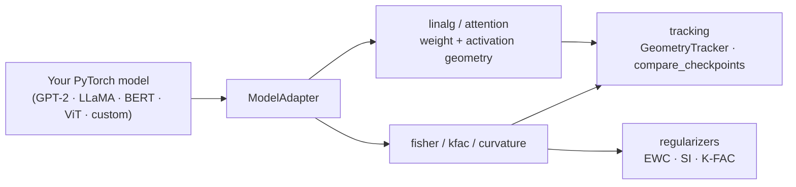

<div align="center">

# modelgeometry

**Architecture-agnostic inspection of weight-space geometry, attention geometry, and curvature (Fisher / K-FAC) for trained PyTorch transformers.**

[](https://pypi.org/project/modelgeometry/)
[](https://pypi.org/project/modelgeometry/)
[](https://github.com/Siddhesh290307/modelgeometry/actions/workflows/ci.yml)
[](LICENSE)

</div>

`modelgeometry` works on any `nn.Module` with standard attention layers —
GPT-style decoder-only models, encoder models, vision transformers, and
arbitrary custom architectures — through a single adapter abstraction,
rather than hardcoding any one model family's attribute names.

Every metric implements a named, independently published technique (cited in
its docstring). The library ships primitives, not composite indices: you
combine them into whatever question you're actually asking.

## Contents

- [Install](#install)
- [How it works](#how-it-works)
- [What's in the box](#whats-in-the-box)
- [Which metric for which question](#which-metric-for-which-question)
- [Runnable examples](#runnable-examples)
- [Reference](#reference)
- [Development](#development)
- [License](#license)

## Install

```bash
pip install modelgeometry          # core: weight-space + attention geometry, Fisher, K-FAC
pip install modelgeometry[report]  # + matplotlib-based plotting helpers
```

## How it works

Every function that touches a model's parameters goes through a
`ModelAdapter`, which resolves attention blocks and Q/K/V projections across
naming conventions — fused (`c_attn`, `qkv`) and separate
(`q_proj`/`k_proj`/`v_proj`, `query`/`key`/`value`) alike:



```python
from modelgeometry import resolve_adapter

adapter = resolve_adapter(model)  # auto-detects GPT-2 / LLaMA / BERT / ViT-style layouts
adapter.num_layers()
adapter.qkv_weights(layer_idx)   # always three separate (out, in) matrices, regardless of source convention
adapter.num_heads(), adapter.head_dim()
```

If a model doesn't match a recognized convention, `resolve_adapter` raises
with instructions rather than guessing — pass `layer_path=`, `attn_name=`,
or `qkv_names=` explicitly for anything unusual.

## What's in the box

**Weight-space geometry** (`modelgeometry.linalg`) — no forward pass needed,
works on any checkpoint directly:

```python
from modelgeometry import effective_rank, spectral_norm, row_cosine_similarity

q = adapter.qkv_weights(0).q
effective_rank(q)            # information-theoretic effective dimensionality
spectral_norm(q)
row_cosine_similarity(q)     # redundancy across projection rows
```

**Attention / activation geometry** (`modelgeometry.attention`), captured via
a hook, no permanent model mutation:

```python
from modelgeometry import HookRegistry, capture_attention_weights, attention_entropy

registry = HookRegistry()
with registry:
    capture_attention_weights(registry, "layer0", adapter.attention_module(0))
    model(input_ids, output_attentions=True)  # eager attention required to capture weights

attention_entropy(registry.captured["layer0"])          # Michel et al., 2019; Voita et al., 2019
```

**Curvature** (`modelgeometry.fisher`, `modelgeometry.kfac`,
`modelgeometry.curvature`):

```python
from modelgeometry import diagonal_fisher, fisher_layer_summary, kfac_factors

fisher = diagonal_fisher(model, dataloader, n_samples=256, loss_fn=my_loss_fn)
fisher_layer_summary(fisher)   # per-parameter mass, top-k mass fraction, effective rank

factors = kfac_factors(model, dataloader, n_samples=256, loss_fn=my_loss_fn)  # Martens & Grosse, 2015
```

**Regularizers** (`modelgeometry.regularizers`) — published formulations,
generically parameterized, for any training loop:

```python
from modelgeometry import EWCPenalty

reg = EWCPenalty(model, fisher=fisher, anchor_params=anchor)
loss = task_loss + reg.penalty()
```

**Tracking & comparison** (`modelgeometry.tracking`):

```python
from modelgeometry import GeometryTracker, compare_checkpoints

tracker = GeometryTracker(model, metrics=[
    ("qkv0_effective_rank", lambda m, a: effective_rank(a.qkv_weights(0).q)),
])
tracker.log_step(step)  # call from any training loop — vanilla PyTorch, HF Trainer, Lightning

compare_checkpoints(model_a, model_b, metrics=[...])  # generic diff report; you choose what the two checkpoints mean
```

## Which metric for which question

| Question | Reach for |
|---|---|
| Which attention heads are pruning candidates? | Low `attention_entropy` or low `attention_effective_rank` on a head across many batches (Michel et al., 2019; Voita et al., 2019) |
| What actually shifted during finetuning? | `compare_checkpoints` with `effective_rank`, `row_cosine_similarity`, or `distributional_distance` on corresponding weight matrices |
| Is training healthy right now? | A `GeometryTracker` logging `effective_rank` or `fisher_layer_summary` per epoch, watching for rank collapse or curvature blowing up |
| Are two architectures / seeds in a comparable regime? | The same `ModelAdapter`-based metrics run across both, before drawing conclusions from either |

These are illustrative starting points, not a fixed taxonomy — every
function returns plain Python/numpy/dict data, so it composes into whatever
analysis you're actually running.

## Runnable examples

See [`examples/`](examples/):

- [`pruning_candidates.py`](examples/pruning_candidates.py)
- [`pretrained_vs_finetuned.py`](examples/pretrained_vs_finetuned.py)
- [`training_health_monitor.py`](examples/training_health_monitor.py)

Each is self-contained against a small HF model — no external dataset
required.

## Reference

- Diagonal empirical Fisher / EWC: Kirkpatrick et al., 2017, *Overcoming
  catastrophic forgetting in neural networks*.
- K-FAC: Martens & Grosse, 2015, *Optimizing Neural Networks with
  Kronecker-factored Approximate Curvature*.
- Synaptic Intelligence: Zenke et al., 2017, *Continual Learning Through
  Synaptic Intelligence*.
- Attention entropy / head-pruning signals: Michel et al., 2019, *Are
  Sixteen Heads Really Better than One?*; Voita et al., 2019, *Analyzing
  Multi-Head Self-Attention*.
- Effective rank / participation ratio: standard information-theoretic
  (Shannon entropy of a normalized spectrum) formulations.

## Development

```bash
pip install -e ".[test]"
pytest
```

Every metric is tested against at least two structurally different model
adapters (e.g. a fused-QKV and a split-QKV model), so no implementation
detail silently assumes one architecture's conventions.

## License

MIT — see [LICENSE](LICENSE).